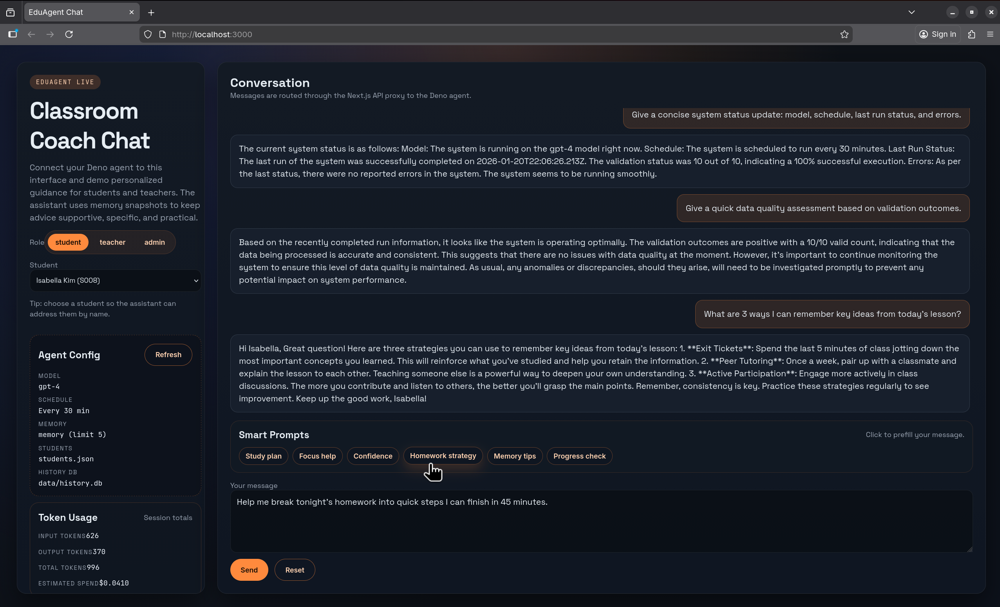

# AI Educational Assistant Agent



## Overview

This repository is a demo MVP of an automated educational assistant that:

- Loads and validates student performance data from a JSON file.
- Computes deterministic, explainable metrics (averages, risk signals, strengths/focus areas).
- Uses an OpenAI model (via LangChain) to generate structured coaching insights.
- Renders those insights into messages (student-facing and teacher-facing).
- Persists an audit trail to SQLite and optional “email output” files on disk.
- Maintains compact “memory” JSON files so guidance can stay consistent across runs.

It is designed for workshop/demo workflows where you want a clear separation between:

- A **Deno** backend that owns secrets, scheduling, storage, and LLM calls.
- A **Next.js** UI (run with **Bun**) that provides a chat interface and proxies requests to Deno.

Additional reference material is in `docs/` (API contract and examples).

## What’s In This Repo

- **Deno agent backend** (`src/`): scheduled analysis pipeline + HTTP API server.
- **Chat UI** (`apps/chat-ui/`): Next.js App Router UI with API route proxies.
- **Shared contracts** (`packages/shared-types/`): TypeScript interfaces + Zod schemas used by both UI and API.
- **Demo data**: `students.json` (student records) and `teacher_rules.json` (optional teacher preferences).
- **Scripts**: `scripts/dev.sh` runs API + UI together.
- **Tests**: `tests/` validates analyzer, validator, and insight parsing.

## Quick Start (Local)

1) Configure the Deno backend:

```bash
cp .env.example .env
# edit .env and set OPENAI_API_KEY
```

2) Start the Deno API server (terminal 1):

```bash
deno task serve
```

3) Start the UI (terminal 2):

```bash
cd apps/chat-ui
bun install
echo 'DENO_AGENT_URL=http://localhost:8000' > .env.local
bun run dev
```

4) Open the UI at `http://localhost:3000`.

If you prefer, run both services together:

```bash
./scripts/dev.sh
```

## Requirements

- Deno 1.40 or higher (backend + tests)
- Bun (recommended) or Node.js (frontend tooling/runtime for Next.js)
- OpenAI API key (any ChatCompletions-capable model supported by `@langchain/openai`)
- Filesystem permissions for:
  - SQLite database path (`HISTORY_DB_PATH`, default `data/history.db`)
  - memory directory (`MEMORY_DIR`, default `memory/`)
  - optional email output directory (`EMAIL_OUT_DIR`)

Notes:

- The SQLite dependency uses Deno’s FFI; the provided Deno tasks include `--allow-ffi`.
- The provided tasks set `DENO_DIR=.deno_dir` so Deno caches (including FFI artifacts) live inside the repo for easier demos.

## Installation

```bash
# Clone repository
git clone <repository-url>
cd ai-education-agent

# Configure environment
cp .env.example .env
# Edit .env with your OpenAI API key and settings
```

## Configuration

Required environment variables in `.env`:

- `OPENAI_API_KEY` - OpenAI API authentication key

Optional configuration:

- OpenAI / model:
  - `OPENAI_MODEL` - model name (default: `gpt-4`)
  - `OPENAI_BASE_URL` - optional base URL for OpenAI-compatible providers
  - `OPENAI_PRICE_INPUT_PER_1K` / `OPENAI_PRICE_OUTPUT_PER_1K` - optional pricing values used to compute `usage.costUsd` for chat responses
- Data inputs:
  - `STUDENTS_JSON_PATH` - student data file path (default: `students.json`)
  - `TEACHER_RULES_PATH` - optional teacher preferences JSON path (default: `teacher_rules.json` if set)
- Persistence:
  - `HISTORY_DB_PATH` - SQLite history database path (default: `data/history.db`)
  - `MEMORY_DIR` - directory for memory files (default: `memory`)
  - `MEMORY_HISTORY_LIMIT` - number of memory history entries retained (default: `5`)
  - `EMAIL_OUT_DIR` - directory for saving “email output” files (if empty, emails are only logged)
- Scheduler:
  - `SCHEDULE_CRON` - cron expression (takes precedence if set)
  - `SCHEDULE_INTERVAL_MIN` - interval fallback in minutes (default: `30`)
- Logging:
  - `LOG_LEVEL` - `debug` | `info` | `warn` | `error` (default: `info`)
- API server:
  - `API_HOST` - host (default: `0.0.0.0`)
  - `API_PORT` - port (default: `8000`)
  - `API_CORS_ORIGIN` - `*` or comma-separated origin allowlist (default: `*`)

Frontend configuration:

- The Next.js UI reads `DENO_AGENT_URL` from `apps/chat-ui/.env.local` (or process env) and proxies all browser traffic through `/api/*`.

## Student Data Format

JSON array with required fields per student:

```json
{
  "id": "S001",
  "name": "Student Name",
  "email": "student@example.com",
  "grades": [{"subject": "Math", "score": 85}],
  "participationScore": 7,
  "assignmentCompletionRate": 90,
  "teacherNotes": "Notes",
  "performanceTrend": "improving",
  "lastAssessmentDate": "2024-09-01"
}
```

Validation rules (enforced by `src/validator.ts`):

- `grades[].score` must be `0..100`
- `participationScore` must be `1..10`
- `assignmentCompletionRate` must be `0..100`
- `performanceTrend` must be `improving | stable | declining`
- `email` must match a basic email pattern
- `lastAssessmentDate` must be parseable as a date

IDs matter:

- The UI uses `/v1/students` to populate the student dropdown, and the selected `studentId` is sent to chat requests.
- Ensure your student IDs in `students.json` match what you expect to use in chat (e.g. `S001`, `S002`, ...).

## Execution

```bash
deno task start
```

This runs the scheduled “tool-first” analysis pipeline (`src/run_with_tool.ts`):

- Performs a tool-based validation pass over the raw student JSON.
- Analyzes all valid students.
- Generates insights and persists history/memory outputs.
- Runs immediately once on startup, then repeats on the configured cron/interval.

Terminate with Control‑C.

## API Server

Run the Deno HTTP API (chat + analysis triggers):

```bash
deno task serve
```

API documentation is in `docs/api-contract.md` (includes `/v1/config` and `/v1/students` for safe runtime settings and student lists).

The server is a lightweight Deno HTTP service built on `Deno.serve`. It acts as the boundary between the UI and the analysis pipeline, enforcing role rules, attaching memory summaries, and returning only safe configuration values. Chat requests are handled synchronously, while analysis runs are triggered on-demand through `/v1/analyze` without interrupting the UI.

Requests and responses are JSON-first and include consistent error shapes so the UI can surface clear messages. CORS handling is configurable via `API_CORS_ORIGIN`, and the service loads configuration once on startup to keep request handling fast and deterministic.

### API Endpoints (Summary)

This summary lists the high-level API surface area used by the UI and operational tooling:

- `GET /health` - health check for the Deno service.
- `POST /v1/chat` - role-based chat responses (student/teacher/admin).
- `POST /v1/analyze` - trigger a full analysis run.
- `GET /v1/history` - recent analysis run history.
- `GET /v1/students` - student list (id + name + email).
- `GET /v1/students/{id}` - student memory + latest insights.
- `GET /v1/config` - safe runtime config values for the UI.

Responses are designed to be safe for client display, omitting secrets while keeping operational context such as schedule cadence and model name.

> Side note: what `/v1/` means  
> The `/v1/*` prefix is **API versioning**. It marks “version 1” of the Deno backend’s HTTP contract (e.g. `POST /v1/chat`, `GET /v1/config`). Versioning makes it possible to introduce a future `/v2/*` with breaking changes while keeping `/v1/*` stable for existing clients. In this repo, the browser usually calls Next.js proxy routes under `/api/*`, and those server routes forward requests to the Deno backend’s `/v1/*` endpoints.

### API Endpoints (Behavior Details)

`POST /v1/chat`

- Validates the basic payload shape server-side (role + message + user id).
- Applies role constraints:
  - `admin`: system-only; `studentId` is rejected.
  - `teacher`: requires `studentId` and loads the student’s memory summary.
  - `student`: uses `studentId` (or falls back to `userId`) to resolve the student profile and load memory.
- Uses dedicated role prompts (student/teacher/admin) in `src/chat_agent.ts`.
- Returns `{ reply, memoryUpdated, usage? }` where `usage` is extracted from LangChain metadata when available.

`POST /v1/analyze`

- Triggers a single run of the analysis pipeline via `runOnce(...)` from `src/run_with_tool.ts`.
- Rejects “student-only” scopes for now (only `scope: all` is supported).
- Includes a simple in-memory “running” guard to avoid overlapping runs.

`GET /v1/history`

- Returns recent run metadata from SQLite (`runs` table), newest first.
- Use `?limit=` to control the number of entries (default 25).

`GET /v1/students`

- Loads `students.json`, validates records, and returns a safe index: `{ id, name, email }`.
- Grades and detailed performance data are intentionally not sent to the UI.

`GET /v1/students/{id}`

- Returns the student’s memory file (if present) and the latest stored insights from SQLite.
- Useful for debugging what the last run produced and what the agent will remember.

## Chat UI (Next.js + Bun)

From a separate terminal:

```bash
cd apps/chat-ui
bun install
bun run dev
```

Set `DENO_AGENT_URL` in `apps/chat-ui/.env.local` to point at the Deno API (default `http://localhost:8000`).

To launch both services together, use:

```bash
./scripts/dev.sh
```

The UI uses the Next.js App Router and ships API route proxies (`apps/chat-ui/app/api/*`) so the browser never calls the Deno server directly. This keeps the dev workflow simple and avoids CORS issues while still letting you deploy the UI separately if needed.

The UI includes:
- Role toggle (student/teacher/admin) with student selector.
- Smart prompts for each role.
- Live agent config panel (from `/v1/config`).
- Token usage and cost summary per session (from `/v1/chat` response metadata).
- Scrollable chat window with auto-scroll on new responses.

Student selection is driven by `/v1/students`, so the UI can always address learners by name and avoid ambiguous IDs. The config panel surfaces runtime values like model, schedule, memory limits, and history path to help you validate that the backend is running with the expected settings.

Smart prompts are scoped to the active role and act as quick-starts for common questions. For example, teacher prompts are oriented around coaching plans and classroom strategies, while admin prompts request system status and run health.

### UI Request Flow

The UI never calls the Deno server from the browser. Instead:

- Browser → Next.js server: `POST /api/chat`, `GET /api/students`, `GET /api/config`
- Next.js server → Deno: forwards the request to `DENO_AGENT_URL` (default `http://localhost:8000`)

This keeps API keys and Deno-only concerns (permissions, file I/O, SQLite) on the backend side.

### How Deno and Bun Work Together

This project intentionally splits responsibilities between two runtimes:

- **Deno** runs the agent backend. It owns environment loading, data validation, scheduled analysis, memory persistence, and all OpenAI/LangChain calls. Deno is used here because it provides a secure permission model and a standard runtime for the existing TypeScript agent pipeline.
- **Bun** runs the Next.js UI. It handles the client-side interface, API route proxies, and fast development tooling for React. Bun is used because it starts Next.js quickly and provides a modern JS runtime for the web frontend.

The two runtimes communicate over HTTP. The Next.js API routes (`apps/chat-ui/app/api/*`) act as a local proxy layer:

- The browser sends requests to the Next.js server (Bun).
- The Next.js route handler forwards the request to the Deno API (`/v1/chat`, `/v1/config`, `/v1/students`).
- The Deno server responds with JSON, which is returned to the browser unchanged.

This proxy pattern keeps the UI decoupled from the backend while avoiding CORS complexity during development. It also means you can deploy the UI and API independently later (for example, Deno on a server and the Next.js UI on a separate host), without changing the UI code.

In local development, you typically run both:

- `deno task serve` (Deno API on `http://localhost:8000`)
- `bun run dev` (Next.js UI on `http://localhost:3000`)

The UI uses `DENO_AGENT_URL` to locate the Deno server. The default points to `http://localhost:8000`, so the two runtimes remain loosely coupled and can be restarted independently without breaking the other side.

Operationally, this creates a clear process boundary:

- The Deno process is a long-running service that exposes API endpoints and optionally runs scheduled analysis via cron or interval timers.
- The Bun/Next.js process is a developer-facing web server that renders the UI and handles short-lived HTTP requests from the browser.

Port and routing layout:

- Deno API binds to `API_HOST:API_PORT` (default `0.0.0.0:8000`).
- Next.js dev server binds to the default Next port (typically `3000`).
- Browser traffic always hits Next.js; server-to-server traffic goes from Next.js to Deno using `DENO_AGENT_URL`.

Configuration separation:

- Deno reads `.env` at startup for model keys, scheduling, memory paths, and database location.
- Next.js reads `apps/chat-ui/.env.local` (or system env vars) for the backend URL only.
- This separation prevents frontend processes from needing direct access to OpenAI secrets.

Contract synchronization:

- Shared API shapes live in `packages/shared-types`, which is imported by both the Deno server and the Next.js UI.
- This makes request/response mismatches visible during development and keeps role rules aligned across runtimes.

Request lifecycle (end-to-end):

1. A user clicks a Smart Prompt in the UI and submits a message.
2. The browser sends `POST /api/chat` to Next.js.
3. The Next.js API handler validates and forwards the payload to Deno at `/v1/chat`.
4. Deno loads memory, applies role rules, calls LangChain/OpenAI, and returns a JSON response with optional usage metadata.
5. Next.js returns that JSON to the browser; the UI renders the reply and updates token usage totals.

Error propagation:

- Deno always returns JSON error shapes (e.g., `{ "error": "...", "detail": "..." }`).
- Next.js passes these errors through to the UI so failures are visible without exposing secrets.
- This preserves a clean boundary for troubleshooting while keeping the UI responsive.

Security and permissions:

- Deno runs with explicit permissions (`--allow-read`, `--allow-env`, `--allow-net`, `--allow-write`) so access is scoped to what the agent needs.
- Bun runs the UI without any OpenAI keys; it only routes requests to Deno.
- This reduces the blast radius of frontend leaks and keeps API keys server-side.

Performance considerations:

- The chat path is synchronous and optimized for quick response generation.
- The analysis pipeline remains separate and can be triggered without blocking chat.
- The UI avoids heavy client-side state and relies on server responses for data freshness.

Deployment patterns:

- **Single host**: Run both services on one machine, bind Deno to `localhost`, and point `DENO_AGENT_URL` to it.
- **Split deployment**: Host Deno on a backend server and deploy the Next.js UI separately; update `DENO_AGENT_URL` accordingly.
- **Reverse proxy**: Put Nginx/Traefik in front, route `/api/*` to Next.js and `/v1/*` to Deno if you want direct API access.

Operational monitoring:

- Deno logs are the source of truth for run history, validation errors, and LLM failures.
- Next.js logs surface proxy and network errors.
- Use `/v1/history` and `/v1/config` to verify runtime state from the UI without shell access.

## Chat Roles and Access Rules

The chat system enforces role-specific behavior:

- `student`: must include a valid `studentId`. Replies address the student by name and focus on encouragement, strategies, and next steps without exposing raw grades or sensitive data.
- `teacher`: must include a valid `studentId`. Replies address the teacher and include structured sections (Student Overview, Strengths, Growth Areas, Next Steps, In-class Strategy, Family/Guardian Note). Teacher responses avoid second-person student phrasing and always refer to the learner by name in third person.
- `admin`: system-only; cannot include `studentId`. Admin messages are restricted to system status, schedule cadence, and last-run summaries with no access to student memory or insights.

These constraints ensure the same API can serve both personalization and oversight without mixing student data into system-level conversations.

## Memory Mode

The default `deno task start` now runs the memory-enabled pipeline. Memory is stored as JSON files so insights can reference past progress:

- `memory/students/{studentId}.json`
- `memory/teacher.json`

To reset memory, delete the `memory/` directory contents.

Per-run memory snapshots are also archived for auditing:

- `memory/archive/run-{runId}-student-{studentId}.json`
- `memory/archive/run-{runId}-teacher.json`

Memory entries are capped by `MEMORY_HISTORY_LIMIT` so files remain compact and safe to re-use in prompts. Archives are immutable per run so you can review how insights evolved over time.

Memory updates are only written after a successful insight generation cycle, which prevents partial or failed runs from polluting long-term context.

### Memory File Shapes

Student memory (`memory/students/{studentId}.json`) is intentionally compact so it can be injected into prompts:

- `summary`: short “what matters” recap
- `strengths`, `improvementAreas`, `goals`: small capped lists
- `history`: short rolling log of recent updates (`MEMORY_HISTORY_LIMIT`)

Teacher memory (`memory/teacher.json`) is class-level:

- `summary`: high-level class overview
- `classGoals`, `focusAreas`: carried forward across runs
- `history`: short rolling log of recent class-level “next steps”

Per-run archives in `memory/archive/` store immutable snapshots keyed by `runId`.

## Tool-First Validation Mode

The memory pipeline also runs a LangChain tool call before analysis to validate the raw student JSON payload. The tool output is logged each cycle before filtering and analysis.

If you want to run the tool-first entry point directly:

```bash
DENO_DIR=.deno_dir deno run --allow-read --allow-env --allow-net --allow-write --allow-ffi src/run_with_tool.ts
```

## Output

Student emails contain positive observations, strengths, improvement areas, actionable strategies, goals, and encouragement. Teacher summaries include class statistics, strengths, students requiring attention, and recommended actions.

Output artifacts:

- **History database** (`HISTORY_DB_PATH`, default `data/history.db`)
  - `runs`: run metadata (`running` / `completed` / failure statuses)
  - `student_messages`: per-student analysis + insights + email metadata
  - `teacher_messages`: teacher summary + insights + email metadata
- **Email output files** (`EMAIL_OUT_DIR`, optional)
  - When set, student and teacher “emails” are written as `.txt` files with a unique name.
  - When empty, “emails” are logged but not written.
- **Memory files** (`MEMORY_DIR`, default `memory/`)
  - Current memory: `memory/students/{id}.json`, `memory/teacher.json`
  - Immutable archives: `memory/archive/run-{runId}-*.json`

## Token Usage and Cost Tracking

When OpenAI returns usage metadata, the API attaches token counts to chat responses. If pricing values are configured, the API also computes estimated USD cost per response and the UI aggregates totals.

Token usage is read from the LangChain response metadata when available (input, output, and total tokens). The UI sums each response into a session-level total so you can gauge the cost of a demo or test session without polling the OpenAI dashboard.

Cost estimates use the configured per‑1k token rates and are intended for rough budgeting rather than billing reconciliation:

```
costUsd = (inputTokens / 1000) * OPENAI_PRICE_INPUT_PER_1K
        + (outputTokens / 1000) * OPENAI_PRICE_OUTPUT_PER_1K
```

Pricing configuration:

- `OPENAI_PRICE_INPUT_PER_1K` - cost per 1k input tokens
- `OPENAI_PRICE_OUTPUT_PER_1K` - cost per 1k output tokens

If pricing is not set, the UI shows token counts but leaves spend as `—`.

## API Contract Details

The API is JSON-first and uses a consistent error shape so the UI can surface failures without guessing:

```json
{ "error": "Message", "detail": "Optional details" }
```

Key request/response behaviors:

- `POST /v1/chat` expects a role-aware payload and returns `reply` plus optional `usage`. Role enforcement happens server-side, and invalid role usage returns a 400 with an error message.
- `GET /v1/students` returns a safe list of students (id + name + email) for UI selection; it does not expose grades.
- `GET /v1/students/{id}` returns memory and latest insights for that student. It is used by the UI to display context and by admins/tools for audit.
- `GET /v1/config` exposes safe runtime values (model, schedule, memory limits, paths) so the UI can display operational context without secrets.

All endpoints are defined in `docs/api-contract.md` with example payloads so the frontend and backend remain aligned.

## Environment Variables Reference

The Deno service reads configuration from `.env` at startup. Common values:

- `OPENAI_API_KEY` (required): API key used by LangChain.
- `OPENAI_MODEL`: model name passed to ChatOpenAI.
- `OPENAI_BASE_URL`: optional base URL for OpenAI-compatible endpoints.
- `OPENAI_PRICE_INPUT_PER_1K` / `OPENAI_PRICE_OUTPUT_PER_1K`: optional pricing values used for spend estimation in the UI.
- `MEMORY_DIR`: root folder for memory files and archives.
- `MEMORY_HISTORY_LIMIT`: max number of entries retained in each memory file.
- `HISTORY_DB_PATH`: SQLite history database path.
- `STUDENTS_JSON_PATH`: path to the student data file.
- `TEACHER_RULES_PATH`: optional teacher preferences JSON file.
- `SCHEDULE_CRON` or `SCHEDULE_INTERVAL_MIN`: schedule configuration for batch analysis.
- `API_HOST`, `API_PORT`, `API_CORS_ORIGIN`: API server binding and CORS rules.

The Next.js UI only needs `DENO_AGENT_URL` in `apps/chat-ui/.env.local` to know where to proxy requests.

## Data Model Glossary

Key objects used across the system:

- **Student**: `id`, `name`, `email`, grade list, participation score, assignment completion rate, trend, and notes.
- **StudentAnalysis**: computed statistics such as averages, strengths, risk signals, and recommended focus areas.
- **StudentInsights**: LLM output used for messaging (positive observation, strengths, improvement areas, strategies, next step goal, encouragement).
- **TeacherSummary**: class-level aggregation of student analyses for teacher-level insights.
- **TeacherInsights**: LLM output for teacher summaries (class overview, strengths, attention needed, next steps).
- **StudentMemory** / **TeacherMemory**: per-entity memory snapshots used to provide continuity across runs.

These models are centrally defined in `src/types.ts` and validated at boundaries.

## Run Lifecycle

Each scheduled or manual run follows a deterministic pipeline:

1. Load and validate `students.json` (invalid entries are logged and filtered).
2. Compute `StudentAnalysis` for each valid student.
3. Call the LLM (LangChain) to produce `StudentInsights`; apply fallback if parsing fails.
4. Generate and save student emails (local simulation).
5. Aggregate results into `TeacherSummary` and `TeacherInsights`, then generate the teacher message.
6. Persist results into SQLite (`data/history.db`) for audit and history.
7. Update memory files and write per-run archives.

Any failure is isolated to the current student or step, logged, and recorded in history so the run can complete without losing all progress.

## Memory System Behavior

Memory is designed to be compact and safe to reuse in prompts:

- Each student has a stable JSON file keyed by `studentId`.
- Each update overwrites the current memory file but also appends to a short rolling `history` array.
- The `MEMORY_HISTORY_LIMIT` caps history size, preventing uncontrolled growth.
- Per-run archives are stored in `memory/archive/` and never overwritten, providing immutable snapshots.

Memory is only written after successful insight generation to avoid corrupting context with partial data.

## Prompting Strategy

Prompts are designed to be structured and role-aware:

- Student prompts are direct, encouraging, and use the student's name.
- Teacher prompts are structured into labeled sections and explicitly address the teacher, not the student.
- Admin prompts are limited to system status and operational context.

Each prompt instructs the model to avoid raw grades and to produce actionable guidance. Responses are parsed and validated before use.

## Validation Strategy

Validation occurs at multiple layers:

- Input validation checks each student record for required fields and type correctness.
- Tool-first mode uses a LangChain tool to validate raw JSON before analysis.
- AI responses are parsed as JSON and validated; invalid outputs trigger deterministic fallback logic.

This layered validation ensures the pipeline remains stable even with imperfect input data or LLM output drift.

## Testing Guide

Unit tests live in `tests/` and mirror core modules:

- `tests/analyzer_test.ts`: verifies analysis calculations.
- `tests/insights_test.ts`: validates parsing and fallback logic.
- `tests/validator_test.ts`: confirms input validation behavior.

Run tests with:

```bash
deno task test
```

If you are iterating on the UI contracts, the shared types are designed to make mismatches obvious during development:

- Contracts: `packages/shared-types/src/contracts.ts`
- Zod schemas: `packages/shared-types/src/schemas.ts`

## Deployment Guide

Typical options:

- **Local demo**: run Deno and Next.js on localhost.
- **Single host**: run Deno + Next.js on the same server with a reverse proxy.
- **Split host**: deploy Deno separately and point `DENO_AGENT_URL` at it.

Use a reverse proxy if you want a single public domain (e.g., route `/` to Next.js and `/v1/*` to Deno).

## Security and Privacy

This project handles imaginary student data and should be treated accordingly:

- Keep `.env` out of version control and avoid exposing API keys to the UI.
- Limit server access with firewall or reverse proxy rules.
- Avoid logging raw student data or LLM prompts in production.

Consider encryption-at-rest for memory and history files if used beyond demos.

## Troubleshooting

Common issues and fixes:

- **Missing env vars**: copy `.env.example` to `.env` and fill in required values.
- **UI cannot reach API**: verify `DENO_AGENT_URL` and that `deno task serve` is running.
- **No token usage shown**: OpenAI usage metadata may not be returned by the model; cost estimates require pricing env vars.
- **Teacher role errors**: teacher requests require a valid `studentId`.
- **Student dropdown is empty**: ensure the Deno API can read `STUDENTS_JSON_PATH` and that `students.json` validates.
- **Memory isn’t changing**: memory updates occur only after a successful insight generation + persistence flow.
- **SQLite path issues**: ensure the directory for `HISTORY_DB_PATH` exists or can be created.

## Project Structure

The codebase follows a modular architecture where each component handles a distinct responsibility within the analysis pipeline. The `src/types.ts` file serves as the central type registry, defining all interfaces and type unions used throughout the system including Student, StudentAnalysis, TeacherSummary, and configuration structures. This centralized approach ensures type consistency across modules and provides a single source of truth for data contracts.

The `src/validator.ts` module implements comprehensive input validation at the system boundary. It verifies data types, validates value ranges, checks email format compliance, ensures required fields are present, and filters invalid records while preserving valid ones. Validation errors are collected and logged but do not halt processing of valid data, demonstrating the system's resilient design.

Performance analysis logic resides in `src/analyzer.ts` as pure computational functions with no external dependencies. The module calculates grade averages, identifies highest and lowest performing subjects, evaluates participation patterns and assignment completion rates, determines risk levels based on multiple factors, and generates structured strengths and improvement areas. This isolation from input/output operations ensures predictable behavior and facilitates unit testing.

The `src/agent.ts` module encapsulates all LangChain integration for communicating with OpenAI models. It creates configured ChatOpenAI instances with appropriate parameters, defines prompt templates that structure requests for student and teacher insights, formats analysis data and teacher preferences into prompts, invokes the language model through LangChain's pipeline abstraction, and returns raw responses for validation. This abstraction layer shields the rest of the application from OpenAI API implementation details.

The `src/agent_with_memory.ts` module extends the LangChain integration by injecting per-student and teacher memory into prompts. This enables longitudinal coaching that builds on prior summaries while still enforcing structured JSON responses for validation and fallback handling.

Response processing occurs in `src/insights.ts` which implements defensive parsing of AI-generated content. The module extracts JSON objects from potentially verbose AI responses, validates all required fields and their types, enforces content length constraints, provides deterministic fallback logic when AI responses fail validation, and renders structured insights into human-readable text format. The fallback system uses rule-based logic to ensure students receive meaningful feedback even when AI services are unavailable or produce invalid output.

Email generation is handled by `src/email.ts` which creates formatted messages for students and teachers. The module builds email content with both plain text and HTML versions, applies personalized formatting based on recipient type, simulates email delivery by saving to local files during development, and provides a clean interface for future integration with production email services.

The `src/storage.ts` module implements the persistence layer using SQLite. It initializes database schema on first run, records complete metadata for each analysis cycle, stores student messages with full context including analysis data and generated insights, maintains teacher summaries with class-wide statistics, and provides methods for querying historical data. The audit trail supports debugging, analytics, and compliance requirements.

The `src/memory_store.ts` module manages long-term memory files. It loads and saves JSON snapshots for each student and the teacher, keeps histories capped to a configurable length, and updates memory only after successful insight generation.

The `src/http_server.ts` module exposes a lightweight Deno API server. It handles chat requests, triggers analysis runs, returns run history, and serves safe runtime configuration and student lists. It also computes token usage cost if pricing configuration is provided.

Internally, it loads a validated student index from `students.json`, applies role-aware rules for chat, and uses the memory store to enrich prompts with prior context. History endpoints query the SQLite store for run metadata so the UI can display recent activity.

The `src/chat_agent.ts` module drives role-aware chat responses. It uses distinct prompts for students, teachers, and admins, injects memory summaries, and extracts token usage from model responses.

The prompt selection is explicit per role to prevent teacher/admin responses from sounding like student guidance. Usage extraction scans the LangChain response object for common token usage shapes so it can work across model providers.

The `packages/shared-types/` package defines shared API contracts and Zod schemas so both the Deno API and Next.js UI agree on request/response shapes.

This shared package reduces drift between frontend and backend and centralizes validation logic for chat, analysis, and config payloads.

The `apps/chat-ui/` Next.js application provides the chat interface. It uses API route proxies (`apps/chat-ui/app/api/*`) to talk to the Deno server, pulls the student list for identification, surfaces runtime config, and renders smart prompts plus token usage totals. The UI is role-aware and presents student selection for teacher/student roles while keeping admin system-only.

UI state is kept client-side to keep the demo simple, while the proxies provide a clean boundary for later deployment behind a reverse proxy or edge runtime.

The `docs/api-contract.md` file captures the API shapes and example payloads, keeping the Deno service and UI aligned.

Treat the contract as the source of truth when extending endpoints or adding new UI features that depend on backend responses.

Teacher preference management in `src/rules.ts` loads optional configuration from JSON files. The module reads and parses teacher preference files, validates and sanitizes preference data, provides sensible defaults when preferences are not specified, and makes preferences available to the AI agent for insight generation customization.

Structured logging functionality in `src/logger.ts` provides consistent operation tracking across the system. The module implements standard log levels from debug through error, formats messages with timestamps and metadata, filters output based on configured verbosity, and routes messages to appropriate output streams based on severity.

The `src/main.ts` orchestration module coordinates all components to execute the complete analysis workflow. It loads configuration from environment variables and validates required settings, initializes the database connection and AI agent, executes analysis cycles that process all students sequentially, implements error handling at multiple levels to prevent cascading failures, manages scheduling through either cron expressions or simple intervals, and provides graceful shutdown handling to ensure data integrity.

The `src/main_with_memory.ts` and `src/run_with_tool.ts` entry points provide memory-aware and tool-first orchestration. Both follow the same core pipeline but add JSON memory injection and explicit validator tool invocation before analysis.

The `src/tools/validate_students_tool.ts` module exposes the validator as a LangChain tool. It returns validation counts and errors as structured JSON and is invoked directly before analysis in tool-first mode.

The `tests/` directory contains unit tests organized to mirror the source structure. Test files include `analyzer_test.ts` for verifying calculation accuracy, `insights_test.ts` for validating parsing logic with both valid and malformed inputs, and `validator_test.ts` for confirming data filtering behavior. Each test uses Deno's built-in testing framework with assertion functions from the standard library.

## Testing

```bash
deno test
```

## LangChain Integration

The system leverages LangChain as an abstraction layer for interacting with large language models, specifically providing a structured interface to OpenAI's chat completion API. LangChain's ChatOpenAI class encapsulates the complexity of API authentication, request formatting, and response handling, allowing the application to focus on prompt engineering and response processing rather than HTTP client implementation.

The integration utilizes LangChain's prompt template system to construct consistent, well-structured requests to the language model. Prompt templates separate the static instruction text from dynamic data, enabling the same prompt structure to be reused across all students while injecting individualized performance data for each request. The system defines separate prompt templates for student insights and teacher summaries, each optimized for its specific output requirements.

LangChain's pipeline composition through the pipe operator creates a clean flow from prompt template through model invocation to response retrieval. This functional approach makes the data flow explicit and reduces boilerplate code that would otherwise be needed to manage the request-response cycle. The abstraction also positions the codebase to potentially support alternative language model providers in the future by swapping the ChatOpenAI instance with a different LangChain-compatible model class.

The prompt engineering strategy instructs the language model to return structured JSON rather than free-form text. This approach enables programmatic validation of responses and ensures consistency in the output format. The prompts explicitly specify required fields, expected data types, array length constraints, and content guidelines such as avoiding raw scores or negative language. By defining clear contracts for AI responses, the system can validate outputs deterministically and trigger fallback logic when responses deviate from specifications.

## Defensive Programming Approach

The architecture embodies defensive programming principles throughout its design, operating under the assumption that external systems are unreliable and data sources are potentially malformed. This philosophy manifests in multiple layers of protection that prevent individual failures from cascading into system-wide outages.

Input validation serves as the first line of defense, scrutinizing all external data before it enters the processing pipeline. The validator module checks every field in student records for type correctness, value range compliance, and logical consistency. Invalid records are filtered out and logged with detailed error messages, but valid records continue through the system unimpeded. This approach prevents malformed data from causing runtime exceptions in downstream components while maintaining visibility into data quality issues.

Error handling follows a consistent pattern where operations that might fail are wrapped in try-catch blocks with appropriate recovery strategies. Database operations log errors but do not crash the application, allowing subsequent analysis cycles to proceed even if recording one cycle's results fails. AI API calls that time out or return errors trigger fallback logic rather than propagating exceptions upward. Email generation failures are logged with full context but do not prevent teacher summary generation. This isolation of failures ensures that problems in one component or with one student do not compromise the entire batch operation.

The fallback logic for AI response processing represents another defensive strategy. When the language model produces invalid JSON, omits required fields, or generates content exceeding length constraints, the system does not simply fail. Instead, it activates rule-based insight generation that applies educational best practices to the same performance analysis data. Students whose AI-generated insights fail validation still receive meaningful, personalized feedback derived from the analytical calculations. This fallback mechanism transforms what would be a system failure into a graceful degradation of service quality.

Validation occurs at multiple system boundaries to create defense in depth. Student data is validated at file load time before processing begins. AI responses are validated immediately after retrieval before any attempt to render them into email content. Configuration values are validated at application startup to fail fast if critical settings are missing or malformed. Each validation layer operates independently, providing redundant protection against different failure modes.

The database audit trail contributes to defensive operation by creating comprehensive logs of all system activity. Every analysis cycle records its start time, completion status, student count, and any errors encountered. Every generated insight is stored with metadata indicating whether AI generation succeeded or fallback logic was employed. This detailed tracking supports post-incident analysis when problems do occur, enabling rapid identification of root causes and affected students.

Resource management practices ensure proper cleanup even when operations fail. Database connections are encapsulated in classes with explicit close methods. File handles are released in finally blocks that execute regardless of whether exceptions occur. The scheduler wraps analysis cycles in error handlers that log failures but keep the scheduling system running. These patterns prevent resource leaks and zombie processes that could accumulate over extended operation periods.

The separation of pure computational logic from input/output operations represents another defensive design choice. The analysis engine performs only mathematical calculations with no file access, network calls, or database queries. This isolation means the core analytical logic cannot fail due to external system problems, and its behavior remains predictable and testable regardless of the operational environment. The determinism of pure functions simplifies debugging and increases confidence in correctness.

## Production Deployment

Ideas to further implement production deployment are; using more secure API key storage, configuring real email service integration, establishing database backup procedures, setting up monitoring and alerting, applying proper access controls, and ensuring compliance with student data privacy regulations and policies.
